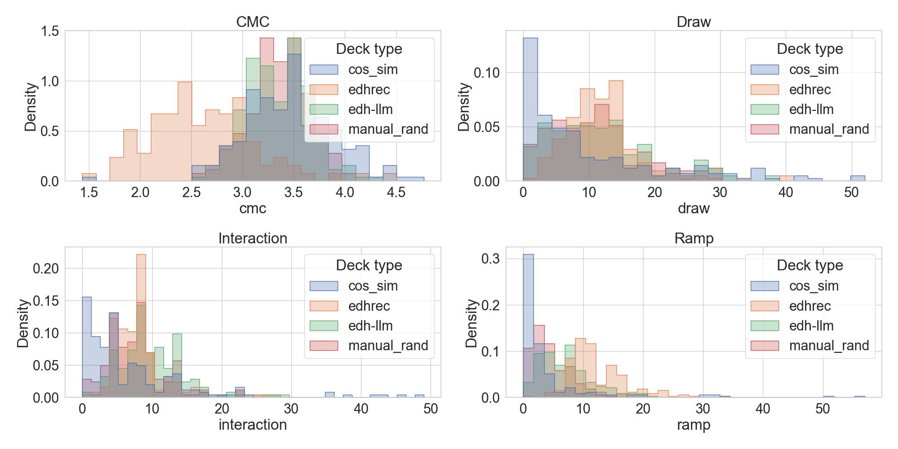

# EDH-LLM: Using NLP techniques to build card game decks
*Theodore Hui, Linus Lin, and Evelyn Yee*

*Mentor: Jingbo Shang*

## About our project
In our project, we propose a novel system for generating playable decks for the card game, ”Magic: The Gathering,” in the commander format (also known as EDH; Elder Dragon Highlander). In this format, decks consist of 1 Commander card, and 99 non-Commander cards. This task combines hard and soft restrictions, maximizing the validity, playability, and power of a deck, in addition to an issue of scale, as there are thousands of possible cards, leading to over 10285 total possible decks. To address the holistic demands of this deck-building task in this large search space, our system features Natural Language Processing (NLP) techniques, alongside a Large Language Model (LLM) in the loop. In this way, we extract the maximum utility from the text data provided with each card and create valid decks with almost no supervised data. Alongside an existing formula for evaluating the power level of EDH decks, we also propose a new, count-based metric for predicting card synergy based on unlabeled historical play data.

## What is EDH?
Magic the Gathering is a deck-building card game where players collect cards and assemble custom decks to play against each other. The Elder Dragon Highlander (EDH) format is loosely structured for deck-building; players must select a Commander card (see below) to lead 99 other cards in a 1v1v1v1 last-man-standing format.

Sample commander card: Atraxa, Praetors' Voice

### The deck building problem
Building a successful deck necessitates the following considerations with varying levels of subjectivity:
1. Hard Restrictions:

    • The commander must be a Legendary Creature. There are thousands of Legendary Creature cards.

    • The other 99 cards in the deck must fit into the color typing of the commander.

2. Soft Restrictions:

    • Synergies: Cards in a deck must play well with each other. This can be expressed in many ways, including typal synergies, playstyle archetypes, and combos.

    • Power Curve: Decks must strike a balance between three main archetypes of cards; card draw, mana generation, and gameplan cards must be evenly balanced in a deck to allow a smooth gameplay experience. Missing a turn due to lack of cards or mana, or failing to execute a gameplan are all risks that can be minimized by good deck composition.

    • Rule Zero: Decks must be fun to play with and play against. This can be achieved by building a deck that is, on average, of comparable speed/strength to other decks in the playgroup.

## Our pipeline

1. Gather database of all Magic: The Gathering cards
2. Convert each card's text to its vector representation
3. Create another vector of each card's various features
4. Use these vectors to create a candidate pool, and add staple cards to it
5. Given a commander, prompt ChatGPT to select appropriate cards for the final deck.
6. Repeat step 5 until a deck of 99 cards is reached.

### Card embeddings
We use Word2Vec, a NLP tool, to convert card text into its vector representation. We calculate the similarity between the specified commander and each card, ranking each pair's similarity. Next, we utilize the same strategy again, but for features instead of text. With each card's feature vector representation, we can calculate the similarity between the commander and each card, again, ranking each pair's similarity. Finally, we aggregate both rankings to create one final, joined ranking.

### Using ChatGPT
With our data consisting primarily of text, NLP tools, such as ChatGPT, can help us find similarities between cards and significantly reduce the search space. ChatGPT has significant potential to help us narrow down the cards even further, as it has been trained on several hundred gigabytes of text, allowing us to indirectly access large amounts of data training with strategic prompting. ChatGPT will allow us to semi-automatically group cards together through the use of guided prompts. This can either be done through the use of iterative prompts, asking ChatGPT to pick which of two cards is most similar to a cluster, or simply iteratively prompting ChatGPT to the add single most similar document to the cluster.

## Evaluation

### Baselines
We evaluate our pipeline against three alternative methods for building EDH Decks:
- **EDHRec Popularity Baseline (edhrec):** Select the top cards which are most frequently played with the selected Commander, according to historical play data from EDHRec
- **Embedding-only Baseline (cos_sim):** Gather the top cards from each text embedding candidate pool, based on cosine similarity to the commander card, without any reranking by GPT-3.5.
- **Random selection Baseline (manual_rand):** Randomly select 63 cards from the custom candidate pool, which incorporates the text embeddings, manual features, and specific staple cards.

### Power Level

We use [an online EDH deck power calculator](https://edhpowercalculator.com/) for evaluating the power level of an EDH deck based on the distribution of functional card types during gameplay. A powerful deck should have a balance of a low average converted mana cost(cmc) (A), card draw (D), deck searching/tutoring (T), mana ramp (R) and interaction/removal (I).2 The original formula was created by the blogger [Disciple of the Vault](discipleofthevault.com/2020/11/18/my-edh-power-level-formula/).

The EDHRec Popularity baseline decks seems to have the highest power, followed by our EDH-LLM decks, and the Random Selection decks. In other words, the historical play data seems to be the best indicator for generating a high power deck.

Comparing EDH-LLM to the Embedding-only (cos_sim) and Random selection (manual_rand) decks, our re-ranking system seems to improve on the custom candidate pools, which improve on the text embedding-only candidate pools. This hierarchy of results seems to confirm the value of each step of our EDH-LLM pipeline, as each step improves on the previous results.

### Synergy

We propose a new metric to estimate the synergy between a pair of cards through a Bayesian probability measure, based on card co-occurrence in decklist data from EDHRec.1 For each deck, we record the average synergy over all pairs of non-basic cards as well as the Commander synergy between each non-commander card and the commander.

The EDHRec Popularity baseline decks have the highest synergy scores, especially for the commander synergy heuristic, because they were built solely from the co-play frequency of each card with the commander. For the other three deck-building systems, the commander synergy scores seem similar. However, for the average synergy (between all pairs of non-commander cards), our final decks seem to demonstrate slightly lower synergy than the other two baselines, which may be explained by the greater diversity in card roles.

Our GPT algorithm (by design) aims to combine both synergistic cards with generic goodstuff 'staples.' These staples, while not the most synergistic, are necessary to balance out the needs of the deck. For example, "Marneus Calgar" is a commander with strong card draw and synergizes with token creation but lacking in ramp and interaction. Building a purely synergistic deck from this commander would be imbalanced, so in real life it's important to have a more diverse deck, especially including staples. In general, our GPT model tended to pick these staples at a higher rate than our other two homebrewed baselines, explaining the lower average synergy but higher average power.

## Conclusion

In this project, we developed a custom pipeline for suggesting decks for the EDH format of play with Magic the Gathering, incorporating NLP tools, like Word2Vec \citep{word2vec} and ChatGPT, with an information extraction approach to this under-studied domain. Decks created by our system achieves moderate power levels, only slightly lower than historically played decks for a much smaller amount of supervised data.

Our results illustrate the complexity of the deck building task, and in the future, we hope to further explore the customizeability of our system, catering deck suggestions to an individual player's needs, including their playstyle, target strength, and competitors.

## Contact
- Theodore Hui: tchui@ucsd.edu
- Linus Lin: l6lin@ucsd.edu
- Evelyn Yee: eyee@ucsd.edu
- Jingbo Shang: jshang@ucsd.edu
